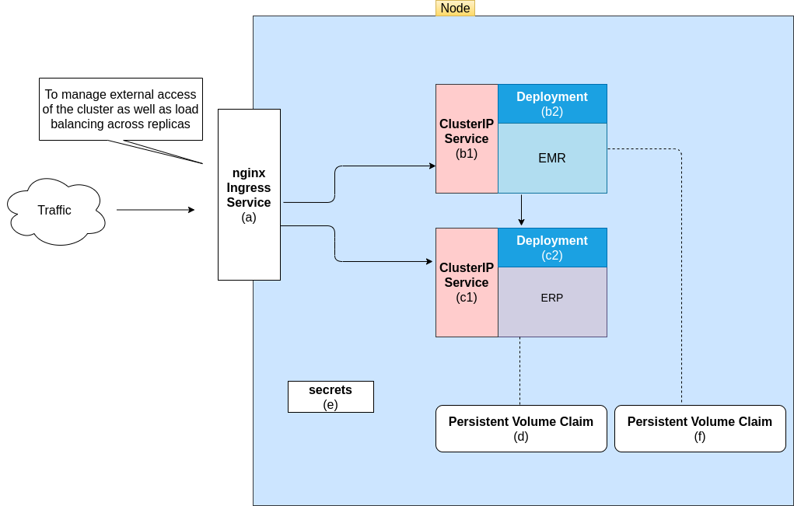

# bahmni_docker

The proposed single node is going look something like:

**Fig 1 - Single Node Cluster**

All of the objects (or components) of this cluster have corresponding implementations in [here](https://github.com/eRegister/bahmni_docker/tree/k8s-cluster/eregisterk8s)